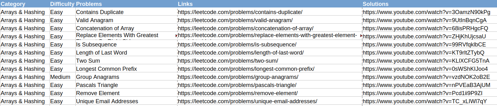

# Scrape Leetcode Problems and Video Solutions from www.neetcode.io

Neetcode created a [YouTube channel](https://www.youtube.com/c/neetcode?themeRefresh=1) and a [website](https://neetcode.io/) to help aspiring developers prepare for their coding interviews. I created a webscraper in selenium that will allow you to scrape Leetcode problems and their respective video solutions from neetcode.io and export them to a local csv file. Very handy if you want to keep notes about certain problems that you struggle with :)

## Getting started

These instructions will get you a copy of the project up and running on your local machine.

### Prerequisites

1. Install the prerequisite packages into your virtual environment using the `requirements.txt` file. The main packages needed for this project are `selenium` and `beautifulsoup`

After activating your desired venv, run the following:

`pip install -r requirements.txt`

2. Selenium requires a driver to interface with the chosen browser. Make sure the driver is in your path, you will need to add your `driver_path` to the `config.json` file.

I used the superior Firefox driver as my driver for this project.

### Usage

Fork and clone/download the repository and change the configuration file with:

* The path to which you would like your csv file to be exported to 

Run `python main.py`.

The resulting csv:

Happy coding!!